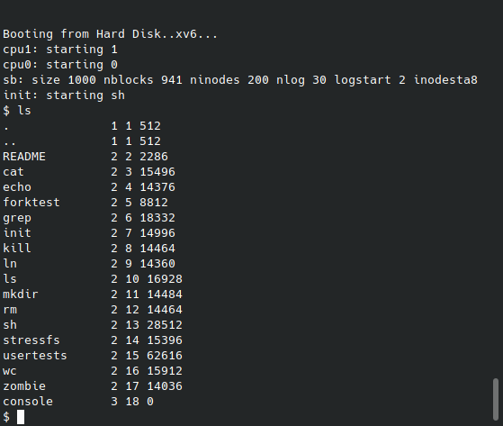
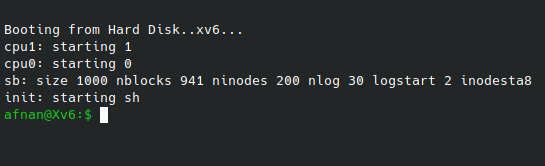
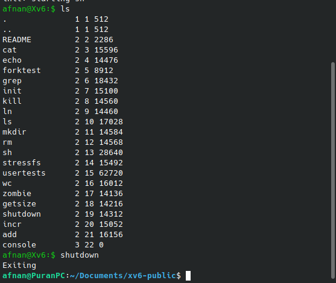
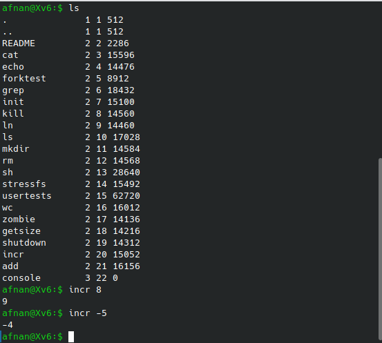
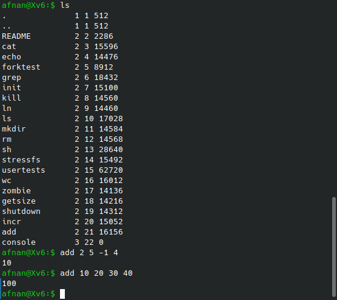
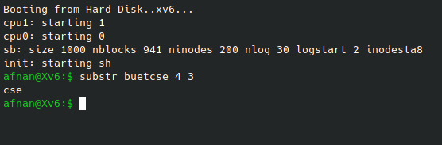
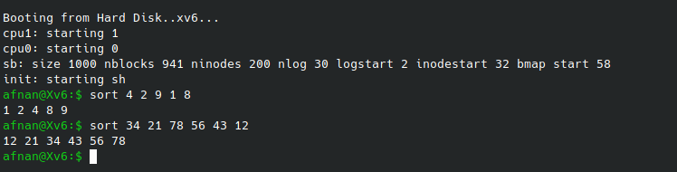

# Dissecting-Xv6
You will get the latest modified verson of Xv6 according to this repository [here](https://github.com/AfnanCSE98/xv6-public)
### Installation in Debian System
Clone the official Xv6 repository from [here](https://github.com/mit-pdos/xv6-public).We need an emulator to boot Xv6.We will use qemu for this purpose.To install qemu, run from your terminal ```sudo apt install qemu```.Then from where Xv6 was cloned , run `make` to compile Xv6.Then to launch the emulator , run `make qemu` and you will see qemu in a different window.If qemu doesn't launch , then run `sudo apt install qemu-system-x86` and then run `make qemu` again.This time , it should work.
Still, you might face problems like [this](https://stackoverflow.com/questions/70515788/booting-xv6-with-qemu) then [here](https://www.reddit.com/r/ManjaroLinux/comments/p4445x/help_xv6_installation_on_manjaro/) is a way around.

To run qemu in the same terminal you're using , run `make qemu-nox` instead of `make qemu`.

### Modifying Source Codes
After qemu is being launched , you will see following system calls by running `ls`


We can modify the source code and see the effects instantly.Lets say we want to replace the `$` sign with something else.To do this , go to `sh.c` file and change inside `getcmd` method.

```cpp
printf(2, ANSI_COLOR_GREEN "afnan@Xv6:$ " ANSI_COLOR_RESET);
```

Add two lines at the top of this file
```cpp
#define ANSI_COLOR_GREEN   "\x1b[32m"
#define ANSI_COLOR_RESET   "\x1b[0m"
```

Now quit from the qemu terminal pressing `cntrl+A` , release and then type x immediately(as you can see it's a tedious task and we will create a system call to exit from the terminal).Then run `make qemu-nox` again and see the result now



### 100% CPU all the time ?
The two CPU usage always seem to be 100%.To resolve this,do following modification.

In `proc.c` , modify `schduler` function 
```cpp
void
scheduler(void)
{
  struct proc *p;
  int ran;
  struct cpu *c = mycpu();
  c->proc = 0;

  for(;;){
    // Enable interrupts on this processor.
    sti();

    // Loop over process table looking for process to run.
    acquire(&ptable.lock);
    for(ran = 0, p = ptable.proc; p < &ptable.proc[NPROC]; p++){
      if(p->state != RUNNABLE)
        continue;

      // Switch to chosen process.  It is the process's job
      // to release ptable.lock and then reacquire it
      // before jumping back to us.
      ran = 1;
      c->proc = p;
      switchuvm(p);
      p->state = RUNNING;

      swtch(&(c->scheduler), p->context);
      switchkvm();

      // Process is done running for now.
      // It should have changed its p->state before coming back.
      c->proc = 0;


    }
    release(&ptable.lock);

    if (ran == 0) {
      halt();
    }
  }
}
```
and in `x86.h` , add a `halt` function
```cpp

static inline void
halt()
{
  asm volatile("hlt" : : );
}
```

### Adding a System call
Let's create a system call to exit from the qemu terminal.We name it as `shutdown`.So we want to do something that would enable us to exit from the terminal by just writing the command `shutdown`.

First create a file named `shutdown.c`.
```cpp
#include "types.h"
#include "stat.h"
#include "user.h"

int main(int argc, char * argv[])
{
    printf(1, "Exiting\n");
    shutdown();
    exit();//eq to return zero
}
```
Notice that to print anything in console , we need to add a file descriptor as the first parameter of printf unlike C language.

Then in Makefile , add it in the UPROGS
```cpp
UPROGS=\
	_cat\
	_echo\
	_forktest\
	_grep\
	_init\
	_kill\
	_ln\
	_ls\
	_mkdir\
	_rm\
	_sh\
	_stressfs\
	_usertests\
	_wc\
	_zombie\
 	_shutdown\
```
Add it also in EXTRA
```cpp
EXTRA=\
	mkfs.c ulib.c user.h cat.c echo.c forktest.c grep.c kill.c\
	ln.c ls.c mkdir.c rm.c stressfs.c usertests.c wc.c zombie.c shutdown.c\
```
Now you can exit from the qemu terminal and run `make qemu-nox` again and see that `ls` will list `shutdown` as a system call.But running this command won't do anything for now.We've to add this system call to 4 following files

* **syscall.c**
Add the following line where similar lines exists
```extern int sys_shutdown(void);```
Then in the next block , add
```[SYS_shutdown] sys_shutdown,```
* **syscall.h**
Add the following line at the end
```#define SYS_shutdown 23```
* **usys.S**
Add the following line at the end
```SYSCALL(shutdown)```
* **user.h**
Add ```void shutdown(void);```

Now,there are two files which contain the methods for system calls.`sysfile.c` contains methods related to files and `sysproc.c` contains methods related to processes.We have to write a new method named `sys_shutdown` in `sysproc.c`.
```cpp
void sys_shutdown(void){
  outw(0xB004, 0x0|0x2000);
  outw(0x604, 0x0|0x2000);
}
```
If everything's fine so far,then you can exit from qemu , run `make qemu-nox` and see the available sytem calls by running `ls`.Run the command `shutdown` and you will see the terminal exiting.



**NB**:I have already implemented few more sytem calls.You won't see add,incr,getsize etc for now if those aren't implemented.

### System call to increment a number
First of all , modify the `atoi` function in `ulib.c` file so that it handles negative numbers too.
```cpp
int
atoi(const char *s)
{
    int i;
    int sign;
    int val;
    int nbr;

    i = 0;
    sign = 1;
    val = 0;
    nbr = 0;
    if (s[0] == '-')
    {
        sign = -1;
        s++;
    }
    i = 0;
    while(s[i] >= '0' && s[i] <= '9' && s[i] != '\0')
    {
        nbr = (int) (s[i] - '0');
        val = (val * 10) + nbr;
        i++;
    }
    i++;
    return (val * sign);
}
```
Then create a `incr.c` file
```cpp
#include "types.h"
#include "user.h"
#include "fcntl.h"

//give command : incr 7
//it will output 8
int main(int argc , char * argv[]){
    printf(1 , "%d\n" , incr(atoi(argv[1])));
    exit();
}
```
modify the files which are needed to be.
* **syscall.c**
Add the following line where similar lines exists
```extern int sys_incr(void);```
Then in the next block , add
```[SYS_incr] sys_incr,```
* **syscall.h**
Add the following line at the end
```#define SYS_incr 23```
* **usys.S**
Add the following line at the end
```SYSCALL(incr)```
* **user.h**
Add ```int incr(int);```

Then add a method in `sysproc.c`
```cpp
int sys_incr(void){
  int num;
  argint(0,&num); //retrieving first integer argument

  //cprintf("%d - Inside system call!",num);

  return num + 1;
}
```
Now exiting and running `make-qemu-nox` again will enable you to use `incr` command.



### System Call to Add multiple numbers
Suppose we want a system call so that `add 2 5 -1 4` will return us `10`.There can be as many numbers as arguments.Now here is an issue.How to pass multiple arguments from user space to kernel space?In case of `incr` we used `argint` method to retrieve the argument but what to do when there are multiple values?

We need to use a structure.Xv6 has a file `stat.h` dealing with structures.Define a new structure in that file.
```cpp
struct mystat {
  int *nums;
  int sz;
};
```
In `sysproc.c` add the following method and make sure you add the header file `stat.h`. 
```cpp
int sys_add(void){
  struct mystat *ct;
  argptr (0 , (void*)&ct ,sizeof(*ct));
  int s = 0;
  int i;
  for(i=0;i<ct->sz;i++){
    s+=ct->nums[i];
    //cprintf("%d " , ct->nums[i]);
  }
  return s; 
}
```
Create a new file `add.c`
```cpp
#include "types.h"
#include "user.h"
#include "fcntl.h"
#include "stat.h"

int main(int argc , char * argv[]){
    struct mystat *ct = malloc (sizeof(struct mystat));
    ct->sz = argc - 1;
    int i;
    for(i = 1;i<argc;i++){
        //printf(1,"%d->" , atoi(argv[i]));
        ct->nums[i-1] = atoi(argv[i]);
    }
    printf(1 , "%d\n" , add(ct));
    exit();
}
```
Now modify following files accordingly

* **syscall.c**
Add the following line where similar lines exists
```extern int sys_add(void);```
Then in the next block , add
```[SYS_add] sys_add,```
* **syscall.h**
Add the following line at the end
```#define SYS_add 24```
* **usys.S**
Add the following line at the end
```SYSCALL(add)```
* **user.h**
Add ```int add(struct mystat*);``` and add `struct mystat;` at the top. 


Now exiting and running `make-qemu-nox` again will enable you to use `add` command.



### System Call to generate substring
Suppose we want to generate substring from a string by specifying start index and substring length.`substr alupotol 3 5` will output `potol`.Let's add a new function in `sysproc.c`
```cpp
char* sys_substr(void){
  static char *str;
  int start_idx , len;
  
  argint(1 , &start_idx);
  argint(2 , &len);
  argstr(0 , &str);
  char* s = &str[0];
  int i;
  int k = 0;
  for(i = start_idx ; i < start_idx+len ; i++){
    s[k++] = str[i];
  }
  s[k]='\0';
  return s;
}

```
And corresponding `substr.c` file
```cpp
#include "types.h"
#include "user.h"
#include "stat.h"

int main(int argc , char * argv[]){
    char *s = argv[1];
    int start_idx = atoi(argv[2]);
    int len = atoi(argv[3]);
    printf(1 , "%s" , substr(s , start_idx , len));
    exit();
}
```
Adding this system call's signature to other files as shown before will enable us to use the system call



### System call to sort integers
We want to give a command `sort 3 5 2 7 4` and expect the output `2 3 4 5 7`.To add a syscall like this , create a `sort.c` file
```cpp
#include "types.h"
#include "user.h"
#include "fcntl.h"
#include "stat.h"

int main(int argc , char * argv[]){
    struct mystat *ct = malloc (sizeof(struct mystat));
    ct->sz = argc - 1;
    int i;
    for(i = 1;i<argc;i++){
        ct->nums[i-1] = atoi(argv[i]);
    }

    int *sorted_nums = sort(ct);

    for(int i=0;i<ct->sz;i++){
        printf(1 , "%d " , *(sorted_nums+i));
    }
    printf(1 , "\n");
    exit();
}
```
And corresponding `sys_sort` function in `sysproc.c` file
```cpp
int* sys_sort(void){
  struct mystat *ct;
  argptr (0 , (void*)&ct ,sizeof(*ct));
  int n = ct->sz;
 
  int temp, j, k;
   
  for (j = 0; j < n; ++j)
  {
    for (k = j + 1; k < n; ++k)
    {
        if (ct->nums[j] > ct->nums[k])
        {
          temp = ct->nums[j];
          ct->nums[j] = ct->nums[k];
          ct->nums[k] = temp;
        }
    }
  }
  return ct->nums;
}
```
After modifying other files accordingly,you can use the command



